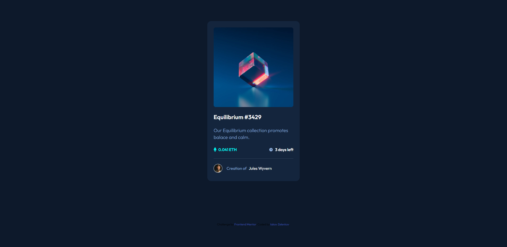

# Frontend Mentor - NFT preview card component solution

This is a solution to the [NFT preview card component challenge on Frontend Mentor](https://www.frontendmentor.io/challenges/nft-preview-card-component-SbdUL_w0U). Frontend Mentor challenges help you improve your coding skills by building realistic projects. 

## Table of contents

- [Overview](#overview)
  - [The challenge](#the-challenge)
  - [Screenshot](#screenshot)
  - [Links](#links)
- [My process](#my-process)
  - [Built with](#built-with)
  - [What I learned](#what-i-learned)
  - [Useful resources](#useful-resources)
- [Author](#author)
- [Acknowledgments](#acknowledgments)

**Note: Delete this note and update the table of contents based on what sections you keep.**

## Overview

### The challenge

Users should be able to:

- View the optimal layout depending on their device's screen size
- See hover states for interactive elements

### Screenshot

### Links

- Solution URL: [Add solution URL here](https://your-solution-url.com)
- Live Site URL: [Add live site URL here](https://iakov-zelenkov-nft-preview.netlify.app/)

## My process

### Built with

-HTML
-SCSS

**Note: These are just examples. Delete this note and replace the list above with your own choices**

### What I learned

First time working with SCSS, found it very helpfull and easy to use

### Useful resources

- [NFT Preview Card Tutoria](https://www.youtube.com/watch?v=DpGEOcgcHeA&t=904s) - a very good tutorial, easy to follow

## Author

- Website - [Iakov Zelenkov](https://github.com/IakovZelenkov)
- Frontend Mentor - [@IakovZelenkov](https://www.frontendmentor.io/profile/IakovZelenkov)

## Acknowledgments

Grizhlie Codes`s tutorial video was a great help (link in links section)
